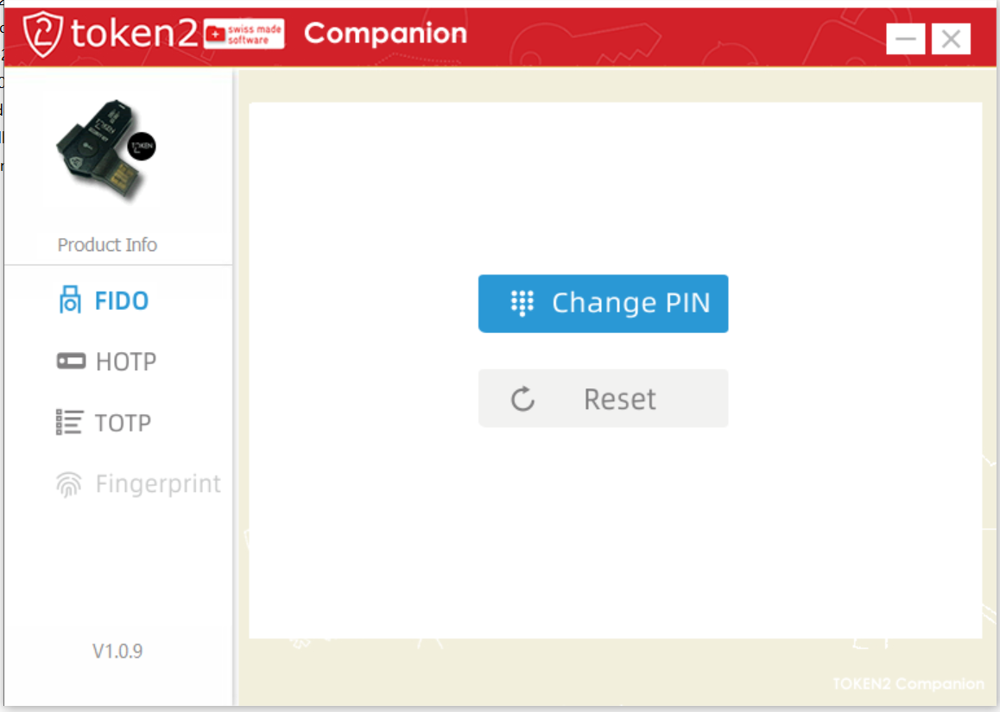
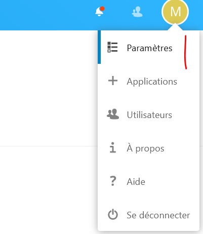

# Nextcloud Passwordless

La fonctionnalité Passwordless ajoutée dans la version 19 de Nextcloud permet de s'authentifier sans mot de passe. Le support de [WebAuthn](https://fr.wikipedia.org/wiki/WebAuthn) permet de s'authentifier sans mot de passe, à l'aide d'une clef compatible [Fido2](https://fidoalliance.org/fido2/).

Nous allons décrire ici comment paramétrer une clef Fido2 pour activer l'authentification sans mot de passe sur Nextcloud 19+.

## Instance de test

### Prérequis
Une machine disponible utilisant Docker, sur laquelle pointe un nom de domaine, qui dispose d'un **certificat SSL valide**. Un reverse-proxy est installé en frontal du container docker.  
Mon instance de test est démarrée avec le fichier [docker-compose.yaml](./docker/). Il est lancé avec la ligne : 

`NEXTCLOUD_URL=mondomaine.tld NEXTCLOUD_ADMIN_USER=admin NEXTCLOUD_ADMIN_PASSWORD=monpassword docker-compose up `

### Authentification WebAuthn / Fido2

Nous avons utilisé une clef [Token2 T2F2 ALU](https://www.token2.com/shop/product/token2-t2f2-alu-fido2-u2f-and-totp-security-key) pour ce test. Elle nous a paru un excelent rapport qualité prix même si elle n'est pas open-source.

#### Paramétrage de la clef
Vous aurez besoin de la [Companion App](https://www.token2.com/site/page/tools-for-programmable-tokens) pour paramétrer votre code PIN. Elle est disponible pour Windows et iOS (version NFC).  
Laissez le temps à votre ordinateur de trouver la clef et d'installr ses pilotes (Windows)

Configurer votre code PIN `1234` par exemple.

#### Paramétrage de votre compte Nextcloud

0. Insérez votre clef dans le port USB
1. Authentifiez vous de manière normale avec votre identifiant et votre mot de passe.
2. Naviguez vers les paramètres

3. Sélectionnez la section _Sécurité_
4. Démarrez l'ajout de la clef Webauthn

5. Une fenêtre vous demande de saisir le code PIN de la clef

6. Vous devrez appuyer sur le bouton de la clef pour valider l'enregistrement de celle ci.

7. Il vous reste à donner un nom à la clef juste ajoutée.

![webauthn]-3(./res/step-4.png)

8. Vous voilà prêt

#### Première authentification

0. Insérez votre clef dans le port USB
1. Depuis un navigateur non authentifié, connectez vous à votre instance Nextcloud : https://mondomaine.tld pour arriver sur la mire de connexion.

2. Choisissez le lien _**Se connecter avec un appareil**_
3. Saisissez votre login, puis cliquez sur _**Connecter**_

4. Composer votre code pin

5. Appuyez sur le bouton de la clef
6. Vous êtes authentifié

## Navigateurs testés

### Pour enregistrement de la clef

| Nextcloud | Système | Navigateur | Version | Résultat |
| --------- | ---------- | ------- | ------- | --------- |
| 19.0.0.12 | Windows 10 | Firefox | 79.0b2 | Echec |
| 19.0.0.12 | Windows 10 | Chrome | 83.0 | Echec |
| 19.0.0.12 | Windows 10 | Edge | 83.0 | Réussite |
| 19.0.0.12 | Windows 10 | Vivaldi | 83.0 | Réussite |

### Pour l'authetification

| Nextcloud | Système | Navigateur | Version | Résultat |
| --------- | ---------- | ------- | ------- | --------- |
| 19.0.0.12 | Windows 10 | Firefox | 79.0b2 | Réussite |
| 19.0.0.12 | Windows 10 | Chrome | 83.0 | Réussite |
| 19.0.0.12 | Windows 10 | Edge | 83.0 | Réussite |
| 19.0.0.12 | Windows 10 | Vivaldi | 83.0 | Réussite |

## Point d'attention

1. Sur Nextcloud, l'authentification par mot de passe reste active. L'authentification WebAuthn est donc un confort. Il faut donc que votre mot de passe soit conforme aux normes de sécurité. Utilisez un gestionnaire de mot de passe, ce sera plus facile.
2. Le corolaire est qu'en cas de perte de votre clef, vous n'êtes pas bloqué.
3. Lorsque la session a expiré, ou pour changer un paramètre sur votre compte, c'est le mot de passe qui est demandé.
4. Le choix de Nextcloud, dans son implémentation est de demander le code PIN à chaque fois. C'est inutile à mon sens. Néanmoins, le désagrément est faible.

