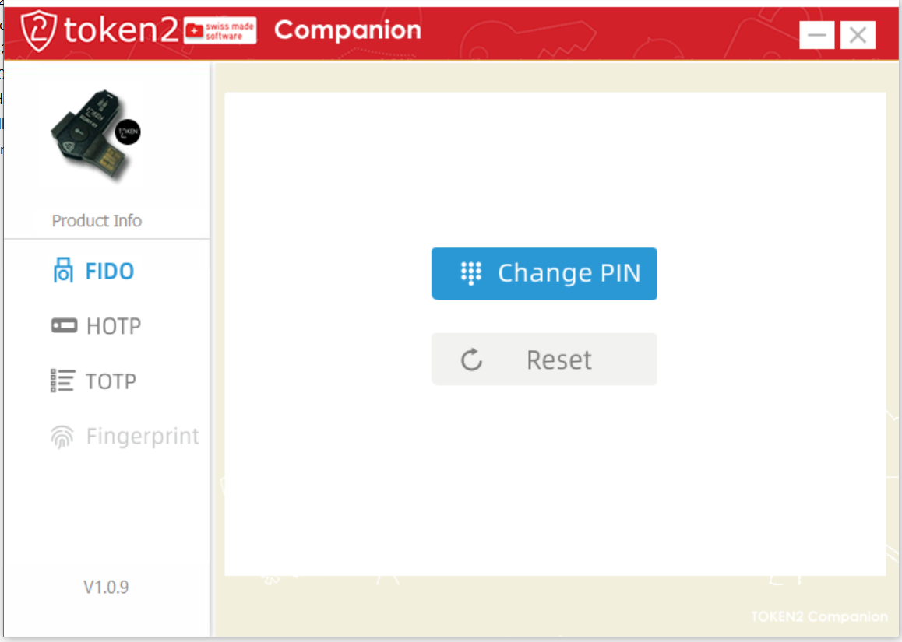
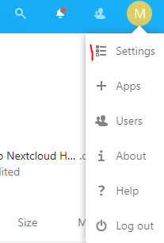
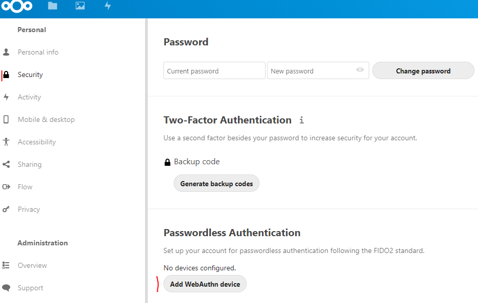
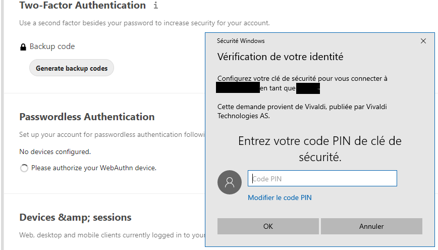
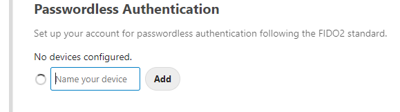
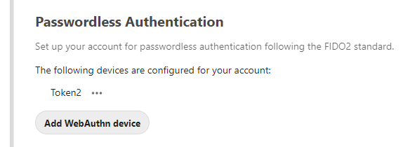
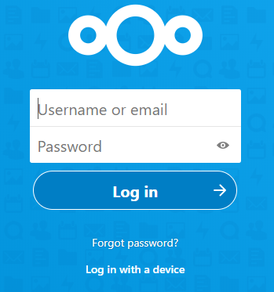
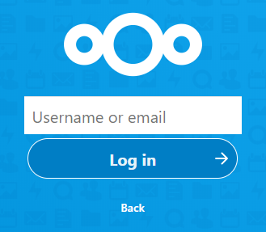
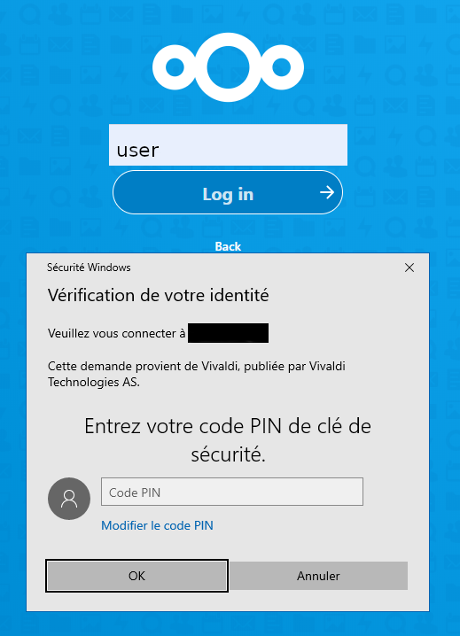
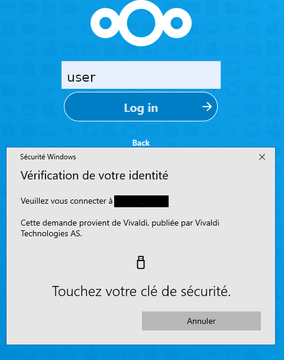

# Nextcloud Passwordless

The passwordless feature has been just added onto Nextcloud V19. It allows authentication without password. [WebAuthn](https://fr.wikipedia.org/wiki/WebAuthn)'s support makes it possibile using a [Fido2](https://fidoalliance.org/fido2/) USB key.

You'll find here the step by step guide to enable your Nextcloud account with the password-less authentication.

## Test service

### Prerequisite
A server or laptop running Dockr is used here. There is other ways to test, we choosed that one. You'll also need a valid domain with a **valid SSL** cert (no self-signed).  
I ran my test container usingf the [docker-compose.yaml](./docker/). It has been launched using the following command line.

`NEXTCLOUD_URL=mydomain.tld NEXTCLOUD_ADMIN_USER=admin NEXTCLOUD_ADMIN_PASSWORD=mypassword docker-compose up `

### Authentication WebAuthn / Fido2

The following key has been tested : [Token2 T2F2 ALU](https://www.token2.com/shop/product/token2-t2f2-alu-fido2-u2f-and-totp-security-key) for this test. It seemed a good quality price ratio despite the lack of open-source / open-hardware.

#### USB key setting
You'll need here the [Companion App](https://www.token2.com/site/page/tools-for-programmable-tokens). It is used to set your PIN code. It works for Windows OS and iOS (NFC key version only). Windows allows you to make it from the settings control panel also since Win10 rel 1903.

set your PIN code. `1234` for instance.

#### Set your Nextcloud account

0. Insert the USB key into the conputer
1. Authenticate using your account and password
2. Go to the settings

3. Navigate to _Security_
4. Sart adding a WebAuthn device

5. A pop-up ask you for the PIN code

6. Press the key button to enroll it
7. Give the key a cool name

8. You're set

#### 1st authentication

0. Insert the USB key into the conputer and log out from your Nextcloud account
1. From your brower, refresh the Nextcloud's login : https://mydomain.tld/login

2. click _**Log in with a device**_
3. Fill your login and press _**Log in**_

4. Enter your pin code

5. Press the hardware button of the USB key

6. You're in

## Tested System & Browsers

### Fido2 key enrollment

| Nextcloud | System | Browser | Version | Result |
| --------- | ---------- | ------- | ------- | --------- |
| 19.0.0.12 | Windows 10 | Firefox | 79.0b2 | Fail |
| 19.0.0.12 | Windows 10 | Chrome | 83.0 | Fail |
| 19.0.0.12 | Windows 10 | Edge | 83.0 | Success |
| 19.0.0.12 | Windows 10 | Vivaldi | 3.1.1929.45 | Success |

### For the authentication

| Nextcloud | System | Browser | Version | Result |
| --------- | ---------- | ------- | ------- | --------- |
| 19.0.0.12 | Windows 10 | Firefox | 79.0b2 | Success |
| 19.0.0.12 | Windows 10 | Chrome | 83.0 | Success |
| 19.0.0.12 | Windows 10 | Edge | 83.0 | Success |
| 19.0.0.12 | Windows 10 | Vivaldi | 3.1.1929.45 | Success |
| 19.0.0.12 | Windows 7 | Firefox | 68.4.1 ESR | Success |
| 19.0.0.12 | MacOS 10.15.5 | Firefox | 78.0 | Success |
| 19.0.0.12 | MacOS 10.15.5 | Safari | 13.1.1 | Success |
| 19.0.0.12 | MacOS 10.15.5 | Chrome | 83.0 | Success |

## Footnotes

1. On Nextcloud the login / password authentication remains active. You must then choose a strong password as per common security rules. Think about using a good Password manager such as [Bitwarden_RS](https://github.com/sosandroid/docker-bitwarden_rs-caddy-synology)
2. The consequence is you cannot be locked out by loosing your USB key. The WebAuthn feature is then a daily convenience, not enough security.
3. When session expires or when changing some settings on your account the password is requested.
4. While authenticating, depending on the OS / Browser the PIN code can be requested or not. This is normal behavior

